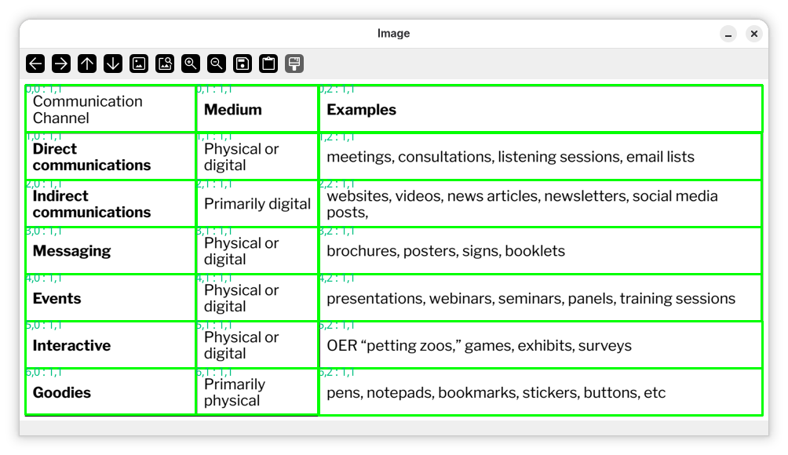

# CLI

An extremely simple CLI is provided for quick demonstration purposes.

!!! note

    An OpenCV build with GUI enabled is required (`opencv-python-headless` will **not** work).

## Arguments

``` sh
positional arguments:
image_path            Path to the image file

options:
  -h, --help            show this help message and exit
  --task {table,layout}
                        The task to perform
  --models-path MODELS_PATH
                        Path to downloaded models
  --runtime {opencv,onnxruntime,transformers}
                        Inference runtime to use
  -log, --loglevel {CRITICAL,FATAL,ERROR,WARN,WARNING,INFO,DEBUG,NOTSET}
                        Logging level to use
```

## Example

``` sh
uv run cells2table tests/data/images/wired.png
```


