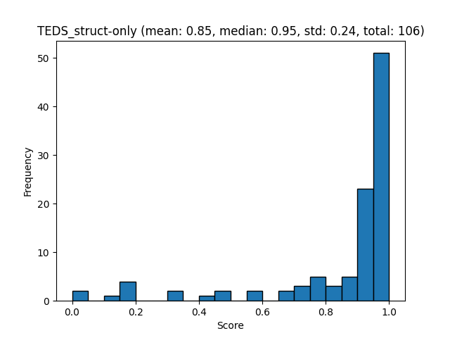
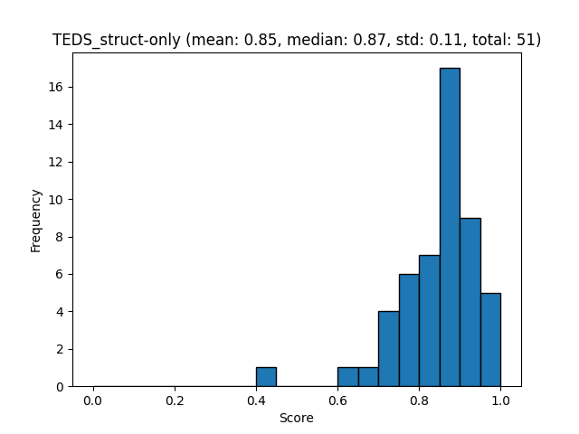
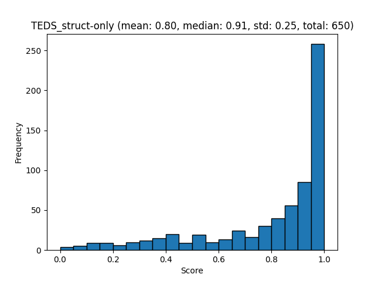
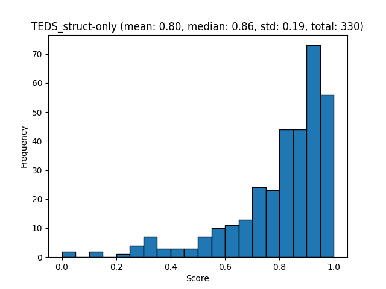

# Evaluation

We use the [Docling-eval](https://github.com/docling-project/docling-eval) evaluation framework to assess the results of the table pipeline as a stage in a complete parsing solution ([Docling](https://github.com/docling-project/docling)).

## Benchmarks

### DP-Bench / DoclingDPBench

Dataset source: [DP-Bench](https://huggingface.co/datasets/upstage/dp-bench), [DoclingDPBench](https://huggingface.co/datasets/docling-project/docling-dpbench)

Docling-eval docs: [DP-Bench](https://github.com/docling-project/docling-eval/blob/main/docs/DP-Bench_benchmarks.md), [DoclingDPBench](https://github.com/docling-project/docling-eval/blob/main/docs/Docling-DP-Bench_benchmarks.md)

> The benchmark dataset is gathered from three sources: 90 samples from the Library of Congress; 90 samples from Open Educational Resources; and 20 samples from Upstage's internal documents. Together, these sources provide a broad and specialized range of information.

55 tables

**Results**:

cells2table

Tableformer

### OmniDocBench

Dataset source: [OmniDocBench](https://huggingface.co/datasets/opendatalab/OmniDocBench)

Docling-eval docs: [OmniDocBench](https://github.com/docling-project/docling-eval/blob/main/docs/OmniDocBench_benchmarks.md)

1651 pages

**Results**:

cells2table

Tableformer

### FinTabNet

Dataset source: [FinTabNet](https://huggingface.co/datasets/docling-project/FinTabNet_OTSL)

Docling-eval docs: [FinTabNet](https://github.com/docling-project/docling-eval/blob/main/docs/FinTabNet_benchmarks.md)

113k tables

### PubTabNet

Dataset source: [PubTabNet](https://huggingface.co/datasets/docling-project/PubTabNet_OTSL)

Docling-eval docs: [PubTabNet](https://github.com/docling-project/docling-eval/blob/main/docs/PubTabNet_benchmarks.md)

388k tables

### PubTables-1M

Dataset source: [PubTables-1M](https://huggingface.co/datasets/docling-project/PubTables-1M_OTSL)

Docling-eval docs: [PubTables-1M](https://github.com/docling-project/docling-eval/blob/main/docs/P1M_benchmarks.md)

1M tables